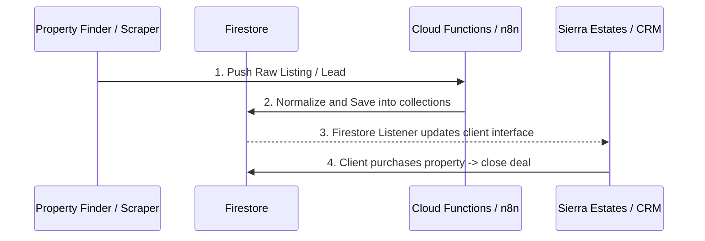

# 🤖 AI Agent & Bot Orchestrations
> **Path:** `docs/memory/agent_orchestrations.md`  
> **Parent Node:** `docs/memory/index.md`

This document details the operations, configurations, and state engines for the **four main AI agents** operating in the Sierra Estates system.

---

## 1. 🕵️‍♂️ WhatsApp Scraper & Lead Finder
*   **Location:** `apps/agents/whatsapp-scraper/index.js`
*   **How it works:** 
    1. Runs as a scheduled task (scheduled via self-hosted `n8n` or local cron).
    2. Navigates to specified owner forums or property portals using **Playwright**.
    3. Scrapes private listings (resale or rent) directly from owners.
    4. Filters duplicate phone numbers and saves parsed listings into a **Google Sheet or Airtable inbox**.
*   **Requirements to work:**
    *   `BROKER_INBOX_SHEET_ID` (Google Sheet ID)
    *   `GOOGLE_SERVICE_ACCOUNT_KEY` (Auth JSON key)
    *   Active internet connection for Playwright.

---

## 2. 👩‍💼 Sierra Bot (AI Luxury Client Concierge)
*   **Location:** `apps/web/lib/hooks/useSierra.ts` (Next.js server hook + AI streams)
*   **How it works:**
    1. Placed directly on the user portal at `/`.
    2. Opens a WebSocket/API stream connecting to **Gemini API** / **Anthropic SDK**.
    3. Recommends luxury properties based on natural language inquiries (e.g. "I want a 3-bedroom villa in Dubai Marina with a waterfront view").
    4. Parses user answers to match against current listings stored in Firestore.
    5. Directly triggers the **Stage-9 Closer** if the user expresses buy/rent intent.
*   **Requirements to work:**
    *   `GOOGLE_AI_API_KEY` (Gemini API key)
    *   Connection to Firebase Firestore (`listings` collection).

---

## 3. 🐪 Leila Bot (Arabic Real Estate specialist)
*   **Location:** Prompt routes in `apps/web/lib/hooks/useSierra.ts` (Leila Mode)
*   **How it works:**
    1. Operates identically to Sierra, but uses an Arabic-specialized, culturally aware prompt persona.
    2. Handles localization of developer brochures and matches listings with Gulf Arab VIP buyers.
*   **Requirements to work:**
    *   Same as Sierra Bot.

---

## 4. 💼 Stage-9 Closer Agent
*   **Location:** `apps/agents/stage-9-closer/CloserAgent.ts`
*   **How it works:**
    1. Instantiated when a client moves to the "closing" stage of a real estate deal.
    2. Generates tailored tenancy contracts or sales agreements using `proposal-generator.ts`.
    3. Invokes **DocuSign API** to scaffold signature workflows.
    4. Generates a **Stripe Checkout Session** link for the security deposit.
*   **Requirements to work:**
    *   `STRIPE_SECRET_KEY`
    *   `DOCUSIGN_INTEGRATION_KEY` + `DOCUSIGN_SECRET`

---

## 🔄 Automated Data Pipeline Loop

