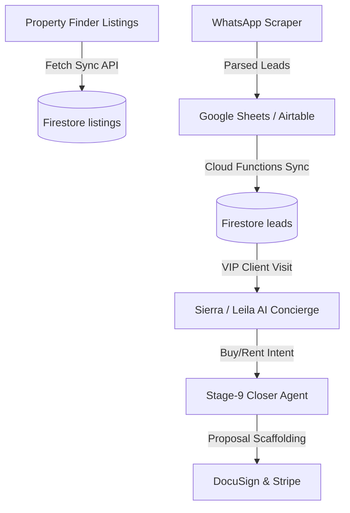

# 🧠 Sierra Estates Memory System: The Obsidian Truth Engine
> **Path:** `docs/memory/index.md`  
> **Aesthetic:** Clean, interconnected, Obsidian-compatible structural documentation.

Welcome to the **Sierra Estates Centralized Memory Base**. This memory base exists to prevent system drift. In a complex monorepos system where Next.js, Firebase rules, Python AI agents, and webhooks are highly coupled, a tiny change in one file can cause cascading breakages elsewhere. 

This Vault serves as the **"Control Node"** for all developers and future AI models (including Google Antigravity and Claude Code). Always update these files when modifying the API, rules, or database models.

---

## 🗺️ The Interconnected Memory Nodes

Click the links below to navigate specific sub-nodes (or open this folder directly in Obsidian/Graphite):

1.  **[🏗️ Architecture & Dependencies](file:///C:/Users/sierr/.gemini/antigravity/worktrees/Final/refine-full-stack-ecosystem/docs/memory/architecture_dependencies.md)**  
    *   Maps the Turbo Monorepo links, configurations (`package.json`, `turbo.json`), and cascading package exports.
2.  **[🤖 AI Agent & Bot Orchestrations](file:///C:/Users/sierr/.gemini/antigravity/worktrees/Final/refine-full-stack-ecosystem/docs/memory/agent_orchestrations.md)**  
    *   Explains exactly how **Sierra Bot**, **Leila**, the **Stage-9 Closer**, and the **WhatsApp Scraper** connect, communicate, and preserve memory states.
3.  **[📡 Property Finder API Gateway](file:///C:/Users/sierr/.gemini/antigravity/worktrees/Final/refine-full-stack-ecosystem/docs/memory/property_finder_integration.md)**  
    *   Detailed specifications of the active Property Finder API credentials, webhooks, and listing sync handlers.
4.  **[🔐 Security Rules & Role Gating](file:///C:/Users/sierr/.gemini/antigravity/worktrees/Final/refine-full-stack-ecosystem/docs/memory/security_rules.md)**  
    *   Ensures that database changes never accidentally expose sensitive client details or bypass role filters.

---

## 🔄 The Data Pipeline Loop

---

## 🛑 The "Zero-Breakage" Golden Rules
Before pushing any change, verify the following gates:

*   **Rule 1: Never change a collection field without updating `apps/web/lib/models/schema.ts` first!** The entire schema validation relies on typescript interfaces declared there.
*   **Rule 2: Never modify public endpoints without checking `lib/server/auth-guard.ts`!** High-risk routes must remain protected.
*   **Rule 3: Ensure that any new property model respects the UAE/Dubai DLD listing types!** (Refer to `property_finder_integration.md` for permit mapping rules).

