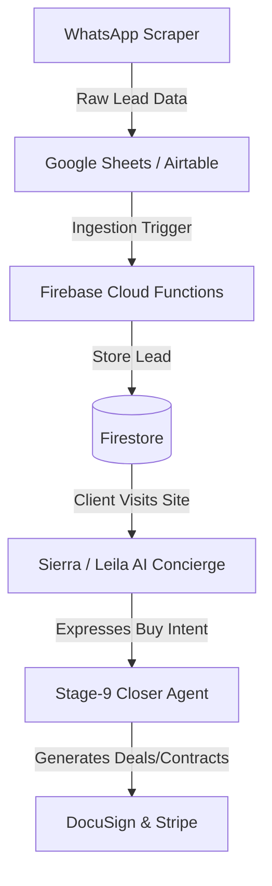

# 🌌 sierra estates 2027: PropTech OS Master Overview & Architecture Guide
> **Purpose:** Copy the entire contents of this file and paste it into Gemini to receive elite architectural feedback, workflow optimizations, and strategy recommendations.

---

## 1. 🌟 Executive Summary & Vision
**Sierra Estates 2027** is a premium, state-of-the-art Real Estate Operating System (PropTech OS) designed for high-end luxury real estate brokerages. 

Instead of a simple listing website, Sierra Estates is a **fully automated transaction and relationship engine**. It combines:
1. **Premium 3D Visual Frontends:** A luxury Next.js client portal with interactive maps (Leaflet + Mapbox GL), gorgeous dark-mode aesthetics, glassmorphism, and smooth animations (Anime.js + Framer Motion).
2. **AI Multi-Agent Brain:** Custom AI agents (Sierra, Leila, Stage-9 Closer) that handle client concierge, automated viewings, Arabic-to-English translations, and contract negotiations.
3. **Data Ingestion Engine:** Automated scrapers and sync systems that pull properties directly from Property Finder, OLX, Google Sheets, and Airtable, feeding them into a secure, staff-gated Firebase Firestore backend.
4. **Visual Workflow Automation:** A self-hosted `n8n` instance running in Docker, coordinating APIs, webhooks, and agent triggers without expensive monthly subscriptions.

---

## 2. 🏗️ Tech Stack & Monorepo Architecture
Sierra Estates is structured as a **pnpm Monorepo** managed by **Turborepo** for parallel execution and builds.

```
refine-full-stack-ecosystem/
├── apps/
│   ├── web/            # Next.js 16 (React 19) Luxury Client Portal (Vercel)
│   ├── admin/          # Vite SPA Admin Panel for CRM/Operations (Vercel)
│   ├── api/            # Python FastAPI Backend for heavy data/agent processing
│   └── agents/         # AI Agent Services (Closer, WhatsApp Scraper, Skills)
├── packages/
│   ├── db/             # Shared Firestore database schemas and models
│   ├── ui/             # Shared UI design system tokens and components
│   ├── auth/           # Shared Firebase Auth configurations
│   └── config/         # Shared ESLint, TypeScript, and Turborepo setups
├── functions/          # Firebase Cloud Functions (Firestore triggers, Webhooks)
├── workflows/          # WhatsApp outreach, scraper scripts, and sheets integration
└── firestore.rules     # Strict Firebase Security Rules (Staff-Gated Roles)
```

---

## 3. 🤖 The Multi-Agent Intelligence Layer
Sierra Estates features **4 primary AI agents** operating in sequence or concurrently:



### 1. 🕵️‍♂️ WhatsApp Scraper & Lead Finder
*   **Purpose:** Actively monitors luxury owner listing sites (Property Finder, OLX, WhatsApp groups) for direct-from-owner listings.
*   **Stack:** Playwright + Node.js (located in `apps/agents/whatsapp-scraper`).
*   **Output:** Pushes clean, structured property data into a Google Sheet or Airtable inbox.

### 2. 👩‍💼 Sierra Bot (AI Client Concierge)
*   **Purpose:** The primary client-facing luxury assistant on the Next.js portal.
*   **Capabilities:** Recommends properties based on HSL color harmony filters, parses natural language budget queries, schedules viewings, and guides users through virtual 3D tours.
*   **Stack:** Next.js Server Actions + Gemini API / Anthropic SDK.

### 3. 🐪 Leila Bot (Arabic-Speaking Real Estate Specialist)
*   **Purpose:** A specialized translation and localization agent.
*   **Capabilities:** Instantly translates developer brochures, coordinates with Arabic-speaking owners, and adapts listings into cultural contexts.
*   **Stack:** Localized prompt routes in `apps/web/lib/hooks/useSierra.ts`.

### 4. 💼 Stage-9 Closer (Automated Deal Closer)
*   **Purpose:** Executes contract scaffolding, proposal generation, and transactional closing.
*   **Capabilities:** Drafts standard tenancy/purchase contracts, hooks into DocuSign MCP for digital signatures, and creates Stripe payment links for security deposits.
*   **Stack:** Python/Node services in `apps/agents/stage-9-closer/`.

---

## 4. 🗄️ Database & Ingestion Protocols
Firestore is the source of truth, protected by strict staff-gated rules in `firestore.rules`:
*   **Collections:** `users`, `listings`, `leads`, `viewings`, `deals`, `conversations`.
*   **Staff Guard:** Access to private listing details or CRM routes is restricted to users with `users/{uid}.role` equal to `admin`, `manager`, or `agent`.
*   **Ingestion:** Airtable and Google Sheets are synchronized every 30 minutes via scheduled functions that map spreadsheet rows to Firestore document models.

---

## 5. 💰 $0 to $20/Month Cost Optimization Strategy
To run a premium platform with zero budget, we utilize free-tier cloud architectures that scale gracefully:

| Service Layer | Provider | Plan & Cost | Cost-Saving Configuration |
|---|---|---|---|
| **Frontend & Admin** | **Vercel** | Hobby Plan — **$0/mo** | Edge rendering, Next.js static asset caching, and ISR. |
| **Backend & Database** | **Firebase** | Spark Plan — **$0/mo** | - **Firestore:** 50K free reads, 20K free writes daily.<br>- **Auth:** 10K free monthly active users.<br>- **Storage:** 5GB free. |
| **AI Processing** | **Google AI Studio** | Free Tier — **$0/mo** | Use **Gemini 1.5 Flash** or **Gemini 2.0 Flash** with a free API key. Limit client session requests to a maximum of 15 requests per minute. |
| **Workflow Engine** | **Docker/VPS** | Self-Hosted n8n — **$5/mo** | Instead of paid $20/mo n8n Cloud, self-host n8n on a **$5/mo VPS** (Hetzner, DigitalOcean) or a **$0/mo free tier** (Oracle Cloud ARM VPS / Railway Free). |
| **Outreach API** | **WhatsApp Cloud API** | Meta Dev Plan — **$0/mo** | 1,000 free service-initiated conversations per month. |
| **Notifications** | **Telegram Bot API** | Standard Plan — **$0/mo** | 100% free alerts on high-priority events (e.g. deals closed, scraper errors). |
| **TOTAL INITIAL COST** | | **$5.00 / month** | Full-scale corporate PropTech running on a coffee budget! |

---

## 6. 🔄 n8n vs. GitHub Actions Workflows
You currently use GitHub Actions (`.github/workflows/external-workflows.yml`) to schedule daily scraper and sync runs. 

### Why n8n is a Game Changer:
1.  **Visual Debugging:** You can see exactly where a WhatsApp message failed or why a lead wasn't added to Firestore.
2.  **No Deployment Lag:** Changing a workflow in n8n takes 5 seconds visually. In GitHub Actions, you have to write YAML code, commit, and push.
3.  **Advanced Integrations:** n8n has pre-built drag-and-drop nodes for **Google Sheets, Airtable, Firebase, WhatsApp Cloud API, Telegram, and OpenAI/Gemini** out-of-the-box.
4.  **State Machine:** n8n can wait 24 hours, check if a client replied, and then trigger Leila or Sierra to follow up.

---

## 7. 🧹 Git Cleanliness & Deduplication Report

### The 63K Files "Bloat" Scan
A deep scan of the 63,283 files in the extra commits on `main` confirms they are **non-code system junk**:
*   `frontend-vercel/` (21,593 files): A duplicated copy of the frontend project containing duplicate node modules.
*   `.agent/` (7,595 files): A copy of global AI assistant profiles, presets, and checklists.
*   `apps/agents/skills/` (15,338 files): **1,444 folders** of duplicate global AI code skills that are already stored in your global user settings.
*   `tests/` (14,692 files): Temporary node_modules, temp files, and test caches.

### The Clean Monorepo (`refine-full-stack-ecosystem`)
The current branch has **already integrated and refined all actual code**:
*   All tests pass (64/64 passing).
*   All duplicate `whatsapp-scraper` and `stage-9-closer` directories are consolidated into single, clean folders in `apps/agents/`.
*   All Firebase configs are unified in the root directory.

---

## 💬 Ask Gemini These Questions:
1. "Given this Next.js + Firebase + Python FastAPI architecture, what is the best way to structure n8n webhook triggers so AI agents can be invoked asynchronously?"
2. "How can I secure my self-hosted n8n instance using Firebase Auth tokens?"
3. "Suggest a prompt optimization for Leila Bot to handle property negotiations in both formal and conversational Gulf Arabic."
